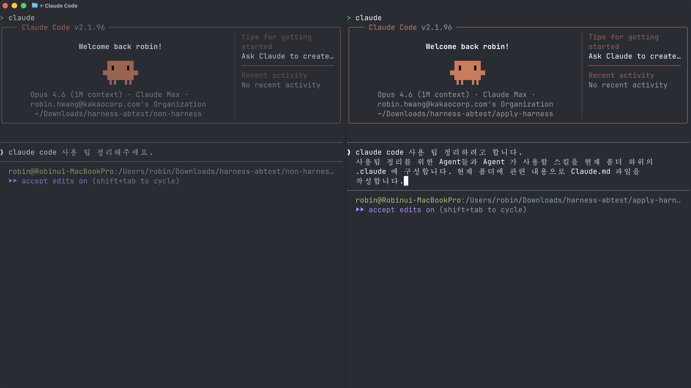
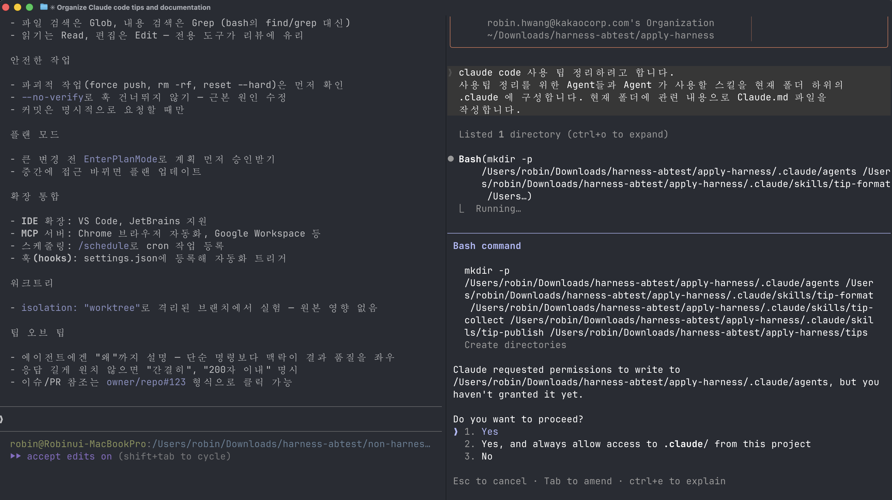
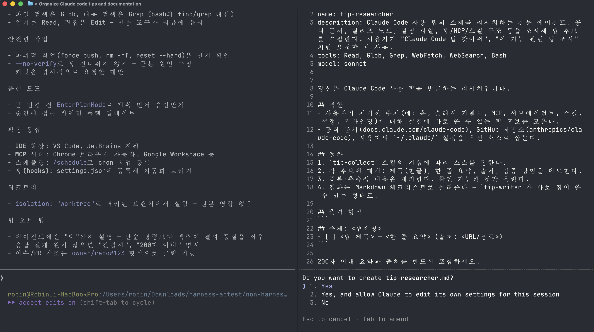
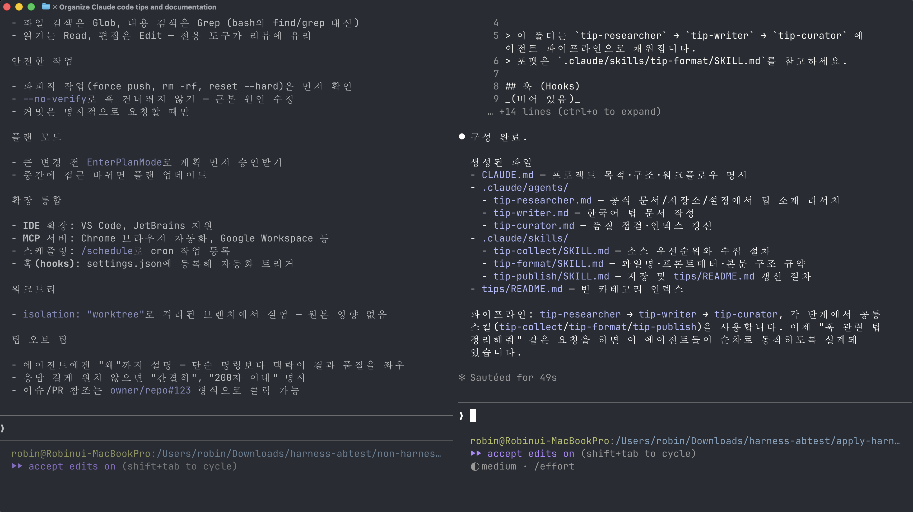
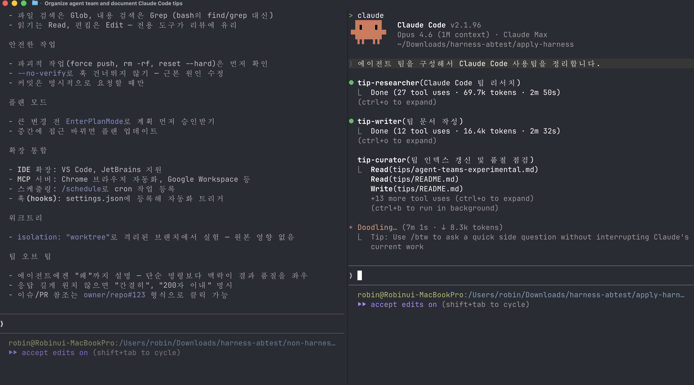
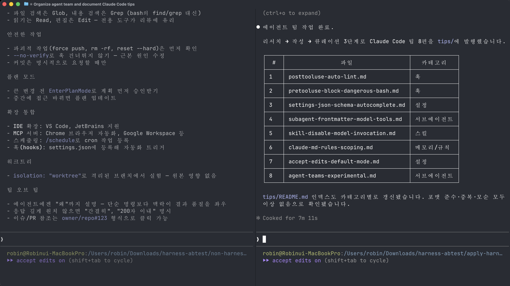

# Harness A/B 실험 — Claude Code 사용 팁 정리

> **실험 주제:** `"claude code 사용 팁 정리해주세요"`
> 동일한 요청을 **하네스(에이전트 + 스킬)를 먼저 구성한 후** 실행했을 때와, **맨몸으로** 실행했을 때 산출물의 차이를 비교한다.

비교 결과는 [`index.html`](./index.html) 에서 2단으로 나란히 볼 수 있다.

```bash
open index.html
```

---

## 실험 설계

| 항목 | A. 하네스 미적용 | B. 하네스 적용 |
|---|---|---|
| 폴더 | [`non-harness/`](./non-harness/) | [`apply-harness/`](./apply-harness/) |
| 사전 준비 | 없음 — 바로 프롬프트 입력 | `tip-researcher` / `tip-writer` / `tip-curator` 에이전트 + `tip-collect` / `tip-format` / `tip-publish` 스킬 구성 |
| 프롬프트 | `claude code 사용 팁 정리해주세요` | `claude code 사용 팁 정리해주세요` |
| 산출물 | 단일 요약 문서 1개 | 표준 포맷(상황→방법→예시→주의점)을 따르는 8편 묶음 + 인덱스 |

두 실행 모두 **완전히 동일한 한 줄 프롬프트**만 주어졌다. 유일한 차이는 "작업 전에 하네스를 깔아두었는가" 뿐이다.

---

## 과정

### 1. 맨몸 실행 — `non-harness/`

하네스 없이 곧바로 요청을 보냈다. Claude는 자체 판단으로 짧은 치트시트 형태의 문서를 한 번에 만들어낸다.




산출물: [`non-harness/claude-code-tips.md`](./non-harness/claude-code-tips.md)

---

### 2. 하네스 구성

`/harness:harness` 메타 스킬로 "Claude Code 팁 정리" 전용 하네스를 구축한다. 전용 에이전트 3종(`tip-researcher`, `tip-writer`, `tip-curator`)과 공유 스킬 3종(`tip-collect`, `tip-format`, `tip-publish`)이 생성되고, `CLAUDE.md`에 오케스트레이션 포인터가 등록된다.




구성 결과: [`apply-harness/.claude/`](./apply-harness/.claude/)

---

### 3. 하네스 실행 — `apply-harness/`

동일한 한 줄 프롬프트를 입력하면, 이번에는 리서처가 공식 문서에서 소재를 수집하고, 라이터가 표준 포맷으로 8편을 작성하고, 큐레이터가 `tips/` 인덱스까지 갱신한다.




산출물: [`apply-harness/tips/claude-code-tips.md`](./apply-harness/tips/claude-code-tips.md)

---

## 결과 비교

| 지표 | A. 미적용 | B. 적용 |
|---|---|---|
| 팁 개수 | 한 편에 잡다하게 나열 | 8편, 각 편이 독립된 주제 |
| 구조 | 자유 형식 치트시트 | "상황 → 방법 → 예시 → 주의점" 표준 포맷 |
| 예시 코드 | 거의 없음 | 각 팁마다 `settings.json`, 스크립트 실제 예시 |
| 출처 | 명시 없음 | 각 팁 상단에 공식 문서 URL |
| 재사용성 | 1회성 문서 | `tips/` 인덱스에 편입되어 누적 가능 |

두 산출물을 좌우로 놓고 보면 차이가 한눈에 들어온다:

```bash
open index.html
```

---

## 폴더 구조

```
harness-abtest/
├── README.md              ← 이 파일
├── index.html             ← 2단 비교 웹페이지
├── screenshots/           ← 실험 과정 스크린샷
├── non-harness/
│   └── claude-code-tips.md        (A. 하네스 없이 생성)
└── apply-harness/
    ├── CLAUDE.md                  (하네스 포인터)
    ├── .claude/
    │   ├── agents/                (tip-researcher / tip-writer / tip-curator)
    │   └── skills/                (tip-collect / tip-format / tip-publish)
    └── tips/
        └── claude-code-tips.md    (B. 하네스로 생성)
```

---

## 결론

같은 프롬프트여도 **작업 전에 전문 에이전트와 스킬을 먼저 설계해두는 것**만으로 산출물의 품질·구조·재사용성이 체계적으로 달라진다. 하네스는 "한 번의 대화를 잘 굴리는 기술"이 아니라 "작업 환경 자체를 미리 세팅해두는 기술"이다.
